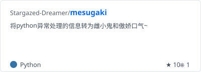
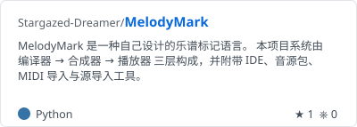
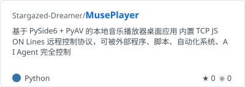
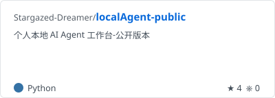
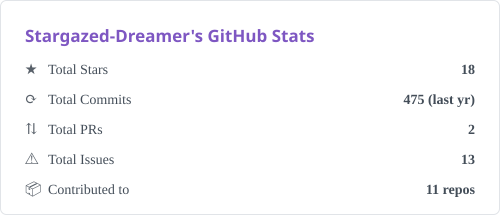
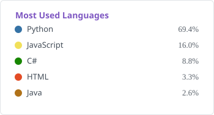
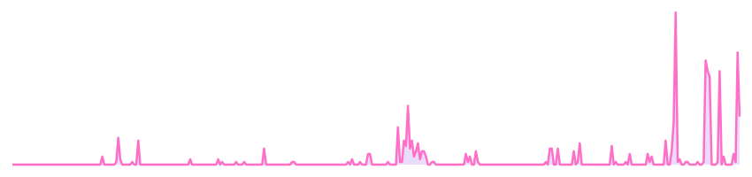

<!-- ============ 顶部 banner（渐变波浪，星空紫→粉） ============ -->

<!-- 打字机标语：三句轮播 -->

我始终相信技术能让生活更美好，希望你也能感受到技术的乐趣
<!-- ============ 自我介绍：以后填 ============
我是……
============================================ -->

## ⭐ 精选

 

## 🎵 音乐线

- **[MelodyMark](https://github.com/Stargazed-Dreamer/MelodyMark)** — 自己设计的乐谱标记语言：编译器 → 合成器 → 播放器三层架构，附 IDE、音源包和 MIDI 导入
- **[MusePlayer](https://github.com/Stargazed-Dreamer/MusePlayer)** — PySide6 本地音乐播放器，内置 TCP JSON 协议，可以被 AI Agent 完全控制（对，它听 Agent 指挥）
- **[MuseArc](https://github.com/Stargazed-Dreamer/MuseArc)** — 超大混乱曲库的清洗与统一管理工具，和 MusePlayer 协同工作

## 🤖 Agent 与自动化

- **[localAgent-public](https://github.com/Stargazed-Dreamer/localAgent-public)** — 个人本地 AI Agent 工作台（公开版）：电脑操控、记忆系统、可自动化工作流
- **[MindForge](https://github.com/Stargazed-Dreamer/MindForge)** — 把散落的多格式文档批量转成结构化、可检索知识库的知识提炼引擎

## 🔧 工具箱

- **[PyFileSync](https://github.com/Stargazed-Dreamer/PyFileSync)** — 跨平台文件备份：本地同步 / 移动硬盘 / Android 双向（ADB），增量更新、断点续传
- **[ElasticBreath](https://github.com/Stargazed-Dreamer/ElasticBreath)** — 用边缘视觉和弹性时间窗做的休息提醒，不会打断你的工作或游戏

## 🎮 游戏与整活

- **[mesugaki](https://github.com/Stargazed-Dreamer/mesugaki)** — 把 Python 报错信息翻译成雌小鬼和傲娇口气。目前 star 最多的原创项目（你们品味不错嘛）
- **[OvercookedSaveTool](https://github.com/Stargazed-Dreamer/OvercookedSaveTool)** — 胡闹厨房存档管理器，大厨们的救星
- **[CustomAutoArk](https://github.com/Stargazed-Dreamer/CustomAutoArk)** — 类 MAA 的自动化实现，目前主要用于个人抽卡数据收集

<picture>
  <source media="(prefers-color-scheme: dark)" srcset="./assets/stats-dark.svg" />
  <source media="(prefers-color-scheme: light)" srcset="./assets/stats-light.svg" />
  
</picture>
<picture>
  <source media="(prefers-color-scheme: dark)" srcset="./assets/langs-dark.svg" />
  <source media="(prefers-color-scheme: light)" srcset="./assets/langs-light.svg" />
  
</picture>

## 年度活动曲线：

<!-- ============ 可选区块：想用就取消注释 ============
## 🐍 我的提交史在逃跑

trophy 成就墙（零维护）：

B 站粉丝徽章（把 <UID> 换成你的 B 站 uid）：
&style=social" />

底部波浪收尾：

============================================ -->

---

本主页由 [mesugaki](https://github.com/Stargazed-Dreamer/mesugaki) 提供技术支持 
<code>AttributeError: 主人居然真的把主页看完啦？真是拿你没办法呢♡</code>

